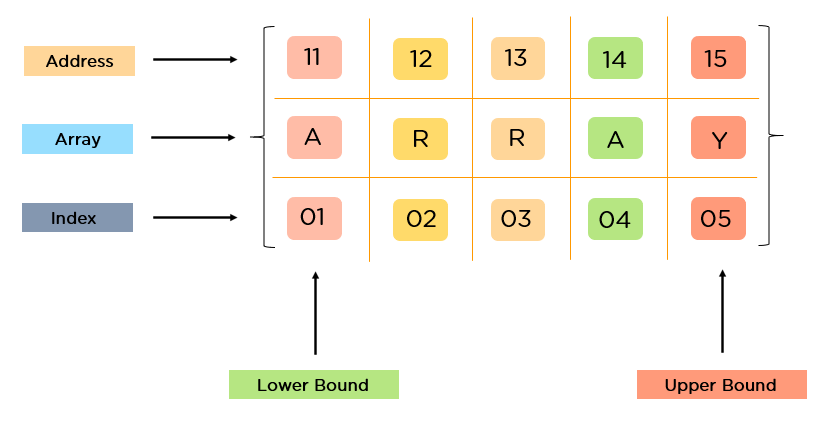
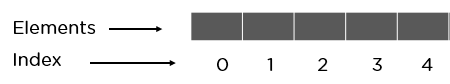
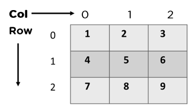
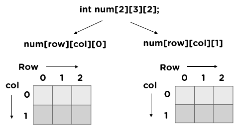
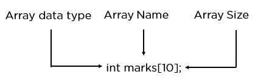

# Day 1: Arrays Part 01


## Table of Contents:
1. [Data Structures](#data_structure)
2. [704. Binary Search](#704)
3. [27. Remove Element](#27)
4. [Notes for Today](#notes)

## References
Carl's article link: 

https://programmercarl.com/%E6%95%B0%E7%BB%84%E7%90%86%E8%AE%BA%E5%9F%BA%E7%A1%80.html


## Data Structures <a name="data_structure"></a>



An array is a linear data structure that collects elements of the same data type and stores them in contiguous and adjacent memory locations. 

Arrays work on an index system starting from 0 to (n-1), where n is the size of the array.

What Are the Types of Arrays?
There are majorly two types of arrays, they are:

One-Dimensional Arrays: 


Two-Dimensional Arrays: 


Three-Dimensional Arrays: 



### How Do You Declare an Array?


Arrays are typically defined with square brackets with the size of the arrays as its argument.

Here is the syntax for arrays:

> 1D Arrays: int arr[n];
> 
> 2D Arrays: int arr[m][n];
> 
> 3D Arrays: int arr[m][n][o];

### How Do You Initialize an Array?
You can initialize an array in four different ways:

#### Method 1:
<code>int a[6] = {2, 3, 5, 7, 11, 13};</code>

#### Method 2: 
<code>int arr[]= {2, 3, 5, 7, 11};</code>

#### Method 3:
<pre><code>int arr[5];

arr[0]=1;

arr[1]=2;

arr[2]=3;

arr[3]=4;

arr[4]=5;
</code></pre>

## 704. Binary Search <a name="704"></a>
### TD;DR

[leetcode link](https://leetcode.com/problems/binary-search/description/)

1. Include ALL possible answers when initialize lo & hi.
2. Don't overflow the mid calculation.
3. Shrink boundary using a logic that will exclude mid.
4. Avoid infinity loop by picking the correct mid and shrinking logic.
5. Always think of the case when there are 2 elements left.

### The pattern
Some of the most common see questions of Binary Search include:

1. Do I use left or right mid?
2. Do I use < or <= , > or >=?
3. How much do I shrink the boundary? is it mid or mid - 1 or even mid + 1 ?
4. ...

Let's talk about it step by step:

**1. Choice of `lo` and `hi`, aka the boundary.**

Normally, we set the initial boundary to the number of elements in the array

`let lo = 0, hi = nums.length - 1;`

But this is not always the case.

We need to remember: the boundary is the range of elements we will be searching from.

The initial boundary should include **ALL** the elements, meaning all the possible answers should be included. Binary search can be applied to none array problems, such as Math, and this statement is still valid.

**2. Calculate `mid`**
Calculating mid can result in overflow when the numbers are extremely big. 


```java
let mid = Math.floor((lo + hi) / 2) // worst, very easy to overflow

let mid = lo + Math.floor((hi - lo) / 2) // much better, but still possible

let mid = (lo + hi) >>> 1 // the best, but hard to understand
```

When we are dealing with even elements, it is our choice to pick the left mid or the right mid , and as I'll be explaining in a later section, a bad choice will lead to an infinity loop.

```java
let mid = lo + Math.floor((hi - lo) / 2) // left/lower mid

let mid = lo + Math.floor((hi - lo + 1) / 2) // right/upper mid
```

**3. How do we shrink boundary**

Shrinking the boundary should depend on how we define the scope:

If we define scope as`[lowBoundary, highBoundary]` it means both bountries are included.

then we should shrink boundaries like below:

```java
// Mid is already processed. Should be excluded from the next round.
if (target > nums[mid]) {
	lo = mid + 1; // mid is excluded
} else {
	hi = mid - 1; // mid is excluded
}
```

If we define scope as`[lowBoundary, highBoundary)` it means left boundary is included while right boundary is excluded.

then we should shrink boundaries like below:

```java
if (target > nums[mid]) {
	lo = mid + 1; // mid is excluded
} else {
	hi = mid; // hi is included, but right boundary is excluded, which means mid is excluded
}
```

**4. while loop**
To keep the logic simple, I always use

```java
while(lo < hi) { ... }
```

do we need to include <= at all?

Again it goes to our define of the scope:

Assume we only have 2 elements [0,0].
```java
// Define as [left,right].
while(lo <= hi){}
```
[0,0] is an legal scope. So we should consier '=' here.

Assume we only have 2 elements [0,0].

```java
// Define as [left,right).
while(lo < hi){}
```
[0,0) is not an legal scope. So we should exclude '=' here.


**5. Avoid infinity loop**
Remember I said a bad choice of left or right mid will lead to an infinity loop? Let's tackle this down.
Example:

#### calculation of mid
```java
let mid = lo + ((hi - lo) / 2); // Bad! We should use right/upper mid!

if (target < nums[mid]) {
	hi = mid - 1
} else {
	lo = mid; 
}
```

Now, imagine when there are only 2 elements left in the boundary.

We have to keep in mind that, the choice of mid and our shrinking logic has to work together in a way that every time, at least 1 element is excluded.

```java
let mid = lo + ((hi - lo + 1) / 2); // Bad! We should use left/lower mid!

if (target > nums[mid]) {
	lo = mid + 1; // mid is excluded
} else {
	hi = mid; // mid is included
}
```

#### manipulation of pointers
Let's see how the manipulation of pointers will do in leading to an infinity loop:

What we should do:

```java
// Define as [left,right].
let mid = lo + ((hi - lo) / 2);

if (target > nums[mid]) {
	lo = mid + 1; // mid is excluded
} else {
	hi = mid - 1; // mid is excluded
}
```

```java
// Define as [left,right).
let mid = lo + ((hi - lo) / 2);

if (target > nums[mid]) {
	lo = mid + 1; // mid is excluded
} else {
	hi = mid; // mid is excluded
}
```


#### Leetcode 704
For 704 Solution
```java
class Solution {
    public int search(int[] nums, int target) {
        int len = nums.length;

        int left = 0;
        int right = len - 1;
        int mid = 0;

        // Define as [left, right]
        while (left <= right) {
            mid = left + (right - left) / 2;
            if (nums[mid] == target) {
                return mid;
            } else if (nums[mid] < target) {
                left = mid + 1;
            } else if (nums[mid] > target) {
                right = mid - 1;
            }
        }
        // Not found
        return -1;
    }
}
```


## 27. Remove Element <a name="27"></a>
[leetcode link](https://leetcode.com/problems/remove-element/description/)

**Intuition: Fast & Slow Pointers**

The intuition behind this solution is to iterate through the array and keep track of two pointers: `slowIndex` and `fastIndex`. The index pointer represents the position where the next non-target element should be placed, while the i pointer iterates through the array elements. By overwriting the target elements with non-target elements, the solution effectively removes all occurrences of the target value from the array.

**Approach**
Initialize index to 0, which represents the current position for the next non-target element.
Iterate through each element of the input array using the i pointer.

For each element nums[fastIndex], check if it is equal to the target value.

If nums[fastIndex] is not equal to val, it means it is a non-target element.

Set nums[slowIndex] to nums[fastIndex] to store the non-target element at the current index position.

Increment index by 1 to move to the next position for the next non-target element.

Continue this process until all elements in the array have been processed.

Finally, return the value of index, which represents the length of the modified array.
Complexity

**Time complexity:**
O(n)O(n)O(n)

**Space complexity:**
O(1)O(1)O(1)

```java
class Solution {
    public int removeElement(int[] nums, int val) {
        int slowIndex = 0;
        for(int fastIndex = 0 ; fastIndex < nums.length ; fastIndex ++){
            if(nums[fastIndex] != val){
                nums[slowIndex++] = nums[fastIndex];
            }
        }
        return slowIndex;
        
    }
}
```


## Notes for Today <a name="notes"></a>

**Binary Search Mastery: A Deeper Dive**

Binary search, the workhorse of algorithmic efficiency, often seems straightforward, but mastering it demands nuanced understanding and strategic testing. Let's delve into some crucial insights:

**1. Interval Invariants: Precision Matters**

Understanding interval invariants is pivotal. If, for instance, the interval is left-closed and right-closed, each binary split must meticulously retain this structure. Subsequent judgments must consistently adhere to the left-closed and right-closed paradigm.

**2. Open or Closed: Does it Matter?**

The choice between an open or closed interval is essentially inconsequential. What matters is a clear grasp of elements within the range after each reduction, with a vigilant eye to avoid boundary oversights.

**3. Edge Cases: Tackling Scenarios**

Binary search involves several nuanced scenarios, notably when dealing with boundaries. Recognizing when `l = 0` and `r = n` requires a `while (l < r)` condition due to the inaccessibility of the value at `r` in the array. Conversely, when `l = 0` and `r = n - 1`, allowing access to the value at `r`, the correct condition is `while (l <= r)`.

**4. Multiple Implementations: Templates for Success**

Binary search exhibits versatility in implementations. Whether the terminus is an open or closed interval can elegantly solve problems, requiring a keen understanding of conditions such as `l < r` or `l <= r`, and the choice between `mid` or `mid ± 1`. After comprehension, memorizing a template streamlines the process, eliminating confusion.

**5. Beyond Basics: Varied Applications**

Binary search transcends conventional uses, finding applications in diverse scenarios such as locating the first element exceeding a target or the initial element satisfying a specific condition. The core principle remains narrowing down potential locations based on satisfying problem conditions, contingent on a pre-sorted array.

**6. Mid Overflow: Tackling Precision Issues**

Addressing mid overflow concerns is crucial. When `mid = (l + r) / 2`, potential overflow arises if `l + r` exceeds `INT_MAX`. Mitigate this by expressing it as `mid = l + (r - l) / 2` or `mid = l + ((r - l) >> 1)`.

**7. Bitwise Advantages: Optimizing Right Shifts**

For positive binary numbers, right-shifting x bits equates to division by 2 to the power of x. Leveraging bitwise operations proves faster than direct division, providing an efficiency boost.

**Element Removal: A Tactical Approach**

**1. Fast and Slow Pointers: Streamlining Operations**

Conceptually, fast pointers identify non-target elements in the original array, assigning them strategically to the new array pointed to by the slow pointer. This tactical move, although both pointers reference the same array, optimizes the removal process.

**2. Common Ground with Binary Search: Navigating Similarities**

Both binary search and element removal share a common thread of continually narrowing the gap between left and right. Assessing whether numbers between left and right adhere to specific conditions forms the crux of both operations.

**3. Vector Size Nuances: Handling Edge Cases**

In the realm of vectors, the size() function returns an unsigned integer. When the array is empty, subtracting one from this value triggers an overflow. Understanding this nuance is crucial in preventing array out-of-bounds errors.

Mastering binary search and efficient element removal is not just about algorithms; it's a nuanced art that elevates your coding prowess. Delve into these intricacies, refine your strategies, and watch your code transcend to new heights of efficiency.